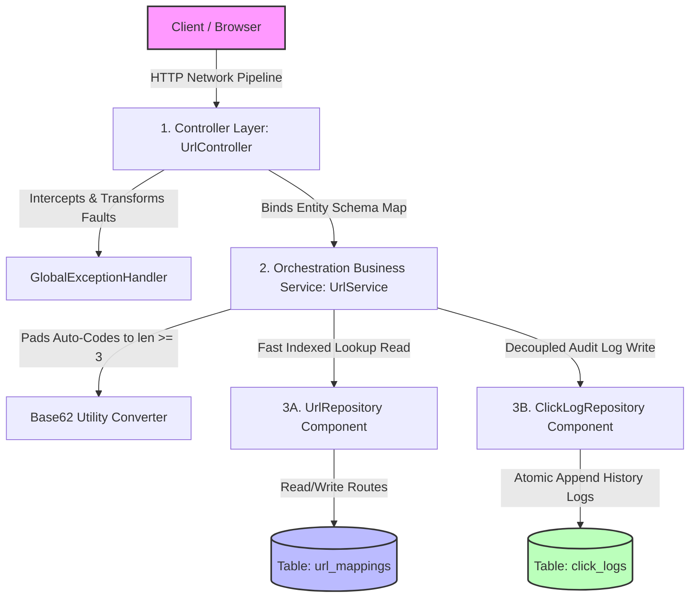
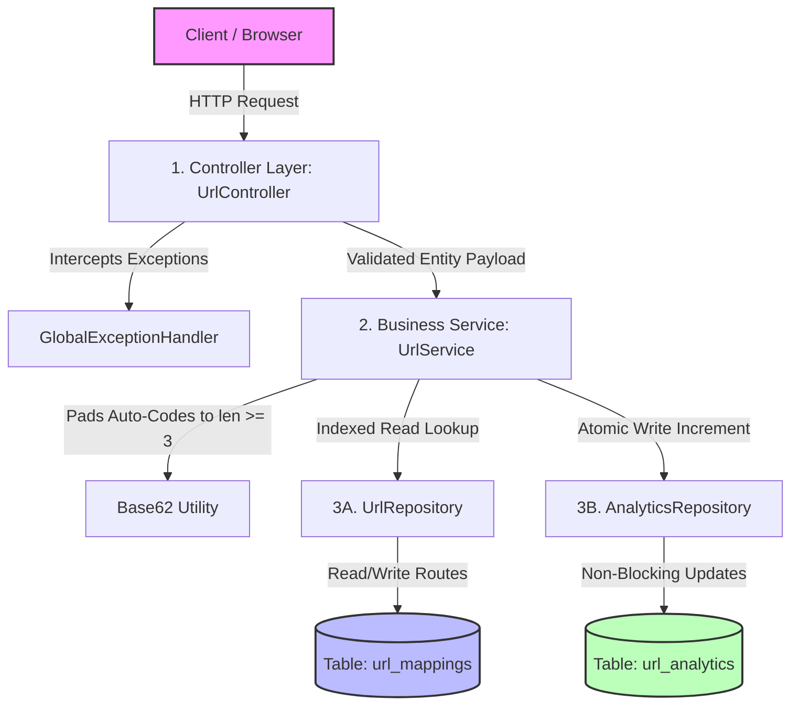

# Production URL Shortener API

A production-grade, highly performant URL Shortener microservice built using **Java 17**, **Spring Boot 3.3.4**, **Spring Data JPA**, and **Swagger UI**. 

The application implements a decoupled storage pattern separating read-heavy path lookups (`url_mappings`) from high-volume analytical visit logs (`click_logs`). This ensures heavy click redirection traffic never blocks transactional database page nodes or causes latency spikes.

---

## Key System Capabilities
- **Guaranteed Short Code Length:** Custom user aliases enforce a strict length policy (3-15 characters). Auto-generated codes translate auto-incrementing database sequence IDs into alphanumeric Base62 strings padded automatically to ensure a minimum length of **at least 3 characters**.
- **Granular Visitor Analytics:** Captures exact click-stream telemetry logs tracking timestamps, client HTTP Referrer metrics, and browser `User-Agent` footprints.
- **Dynamic Time-To-Live (TTL) Expiration:** Supports an optional `expiresAt` absolute expiration window. Stale routes are invalidated passively during runtime lookups or actively swept away by an asynchronous hourly database clean worker.
- **Uniform Fault Tolerance:** Uses a global exception intersection advisor layer that catch failures and translates them into predictable, human-readable JSON responses with exact semantic HTTP codes.

---

## System Architecture Diagram

This flowchart displays the end-to-end request pipeline. It highlights how exceptions are intercepted centrally and how data streams map cleanly to isolated underlying table scopes.



---

## Complete API Technical Endpoint Reference

### 1. Create Shortened URL Link
Generates a compact short code route mapping. Falls back to padded auto-generation if the optional `alias` field parameter is omitted.
- **Endpoint:** `POST /api/shorten`
- **Headers:** `Content-Type: application/json`
- **Payload Request Schema:**
  ```json
  {
    "url": "https://spring.io",
    "alias": "boot-docs",
    "expiresAt": "2026-10-01T12:00:00"
  }
  ```
- **Response Success (200 OK):**
  ```json
  {
    "code": "boot-docs",
    "shortUrl": "http://localhost:8080/boot-docs"
  }
  ```
- **Response Error (400 Bad Request - Past Expiration / Invalid Alias Constraint):**
  ```json
  {
    "timestamp": "2026-09-23T13:15:22.102938",
    "status": 400,
    "error": "Bad Request",
    "message": "Expiration time cannot be set in the past."
  }
  ```

### 2. Live Web Redirection Route
Resolves a shorthand token string path variable into a direct HTTP browser location redirect. Captures incoming request tracking headers transparently.
- **Endpoint:** `GET /{shortCode}`
- **Headers Captured:** `Referer` (Optional), `User-Agent` (Optional)
- **Response Success (302 Found):**
  - **Body:** *None / Empty Content*
  - **Headers:** `Location: https://spring.io`
- **Response Error (410 Gone - Link Expiry Time Surpassed):**
  ```json
  {
    "timestamp": "2026-09-23T13:18:44.555666",
    "status": 410,
    "error": "Gone",
    "message": "This short link has been deactivated."
  }
  ```

### 3. Retrieve Performance Metrics Metadata
Fetches comprehensive tracking details, configuration flags, and granular click log metrics.
- **Endpoint:** `GET /api/metadata/{shortCode}`
- **Response Success (200 OK):**
  ```json
  {
    "originalUrl": "https://spring.io",
    "status": "ACTIVE",
    "createdAt": "2026-09-23T12:42:05.102938",
    "expiresAt": "2026-10-01T12:00:00",
    "hitCount": 1,
    "customAlias": true,
    "clicksInfo": [
      {
        "timestamp": "2026-09-23T13:20:11.441092",
        "referrer": "https://github.com",
        "userAgent": "Mozilla/5.0 (Macintosh; Intel Mac OS X 10_15_7)"
      }
    ]
  }
  ```

### 4. Administrative Visibility Management Toggle
Modifies a specific short link's visibility state dynamically without losing its visitor history logs.
- **Endpoint:** `PATCH /api/status/{shortCode}`
- **Headers:** `Content-Type: application/json`
- **Payload Request Schema:**
  ```json
  {
    "active": false
  }
  ```
- **Response Success (200 OK):**
  ```json
  {
    "message": "Link state modified successfully"
  }
  ```

---

## Local Verification & Execution Run

1. **Launch Core Spring Application Server Process:**
   ```bash
   mvn clean compile spring-boot:run
   ```
2. **Access Interactive Swagger UI Live Documentation Dashboard:**
   Open your browser window page and navigate to: [http://localhost:8080/swagger-ui/index.html](http://localhost:8080/swagger-ui/index.html)
3. **Execute Comprehensive Integration Test Suite Suite:**
   Runs verification pipelines tracking all 12 happy paths and custom exception states:
   ```bash
   mvn test
   ```


## System Architecture Flow

